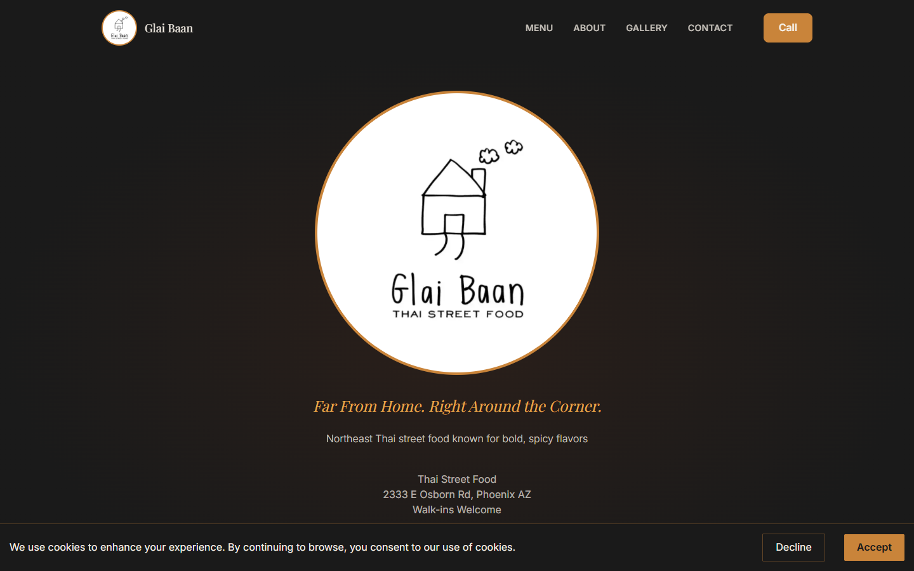
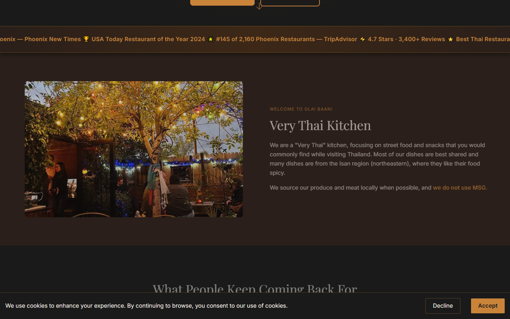
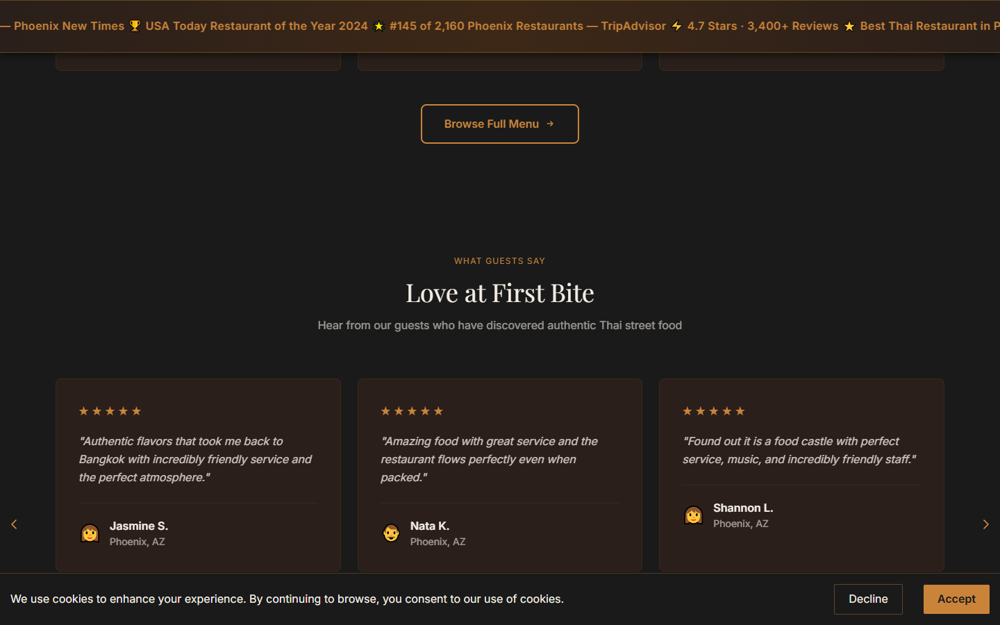
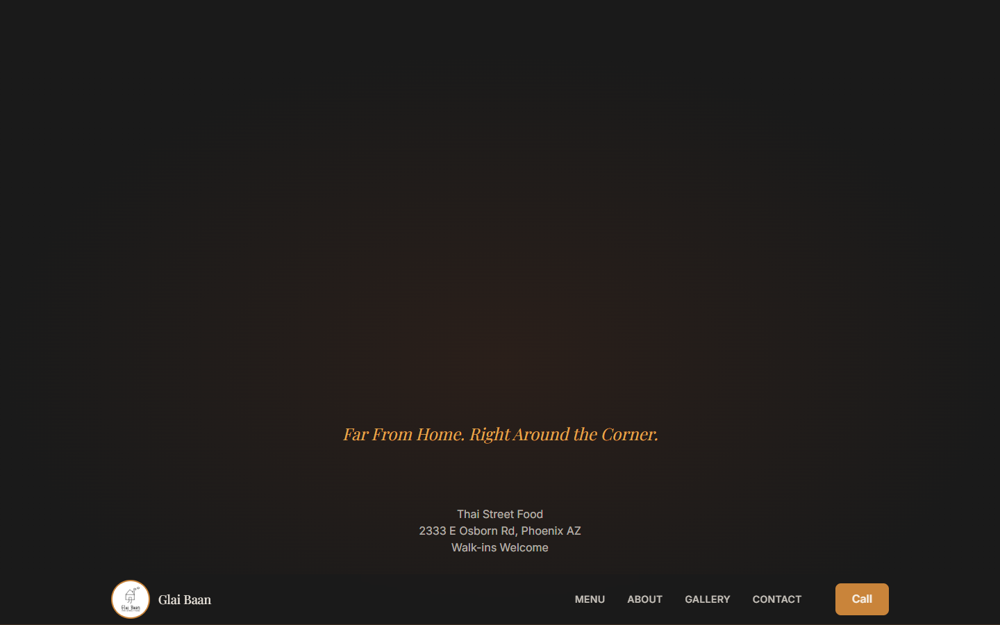

# Glai Baan — Authentic Isan Thai Restaurant

Built for a local restaurant as a complete redesign and modernization of their web presence.

> A modern, animated marketing website for **Glai Baan**, an authentic Isan Thai restaurant. Built with Next.js 14, Tailwind CSS, and Framer Motion.

**Live Site:** [glai-baan.vercel.app](https://glai-baan.vercel.app)

---

## Screenshots

### Hero


### About & Popular Dishes


### Testimonials


### Visit Us


---

## Features

- **Animated hero** with smooth entrance transitions and dual CTAs
- **Popular dishes carousel** with touch/click navigation
- **Photo gallery** showcasing the restaurant interior and ambience
- **Press strip** featuring media highlights
- **About section** with the restaurant story
- **Visit Us** with hours, address, and Google Maps link
- **Cookie consent** banner (GDPR-friendly)
- **Fully responsive** — mobile, tablet, desktop

---

## Tech Stack

| Layer | Technology |
|---|---|
| Framework | [Next.js 14](https://nextjs.org) (App Router) |
| Language | TypeScript |
| Styling | [Tailwind CSS](https://tailwindcss.com) |
| Animations | [Framer Motion](https://www.framer.com/motion/) |
| Icons | [Lucide React](https://lucide.dev) |
| Cookie Consent | [react-cookie-consent](https://github.com/Mastermindzh/react-cookie-consent) |
| Deployment | [Vercel](https://vercel.com) |

---

## Project Structure

```
src/
├── app/
│   ├── layout.tsx        # Root layout, fonts, metadata
│   └── page.tsx          # Page composition
├── components/
│   └── sections/
│       ├── Header.tsx        # Navigation bar
│       ├── Hero.tsx          # Full-screen hero with CTAs
│       ├── PressStrip.tsx    # Media/press mentions
│       ├── About.tsx         # Restaurant story
│       ├── PopularDishes.tsx # Dish carousel
│       ├── Gallery.tsx       # Photo grid
│       ├── Testimonials.tsx  # Customer reviews
│       ├── VisitUs.tsx       # Hours & location
│       └── Footer.tsx        # Footer with links
└── data/
    └── dishes.ts         # Dish data
public/
└── images/               # Restaurant photos and logo
```

---

## Getting Started

### Prerequisites

- Node.js 18+
- npm

### Installation

```bash
# Clone the repo
git clone https://github.com/Spiraal87/Glai-Baan.git
cd Glai-Baan

# Install dependencies
npm install

# Start the dev server
npm run dev
```

Open [http://localhost:3000](http://localhost:3000) in your browser.

---

## Build

```bash
# Production build
npm run build

# Start production server locally
npm start

# Lint
npm run lint
```

### Build Output

```
Route (app)                    Size     First Load JS
┌ ○ /                         51.8 kB        145 kB
└ ○ /_not-found               873 B         88.2 kB
+ First Load JS shared         87.3 kB
```

All routes are statically prerendered (`○ Static`).

---

## Deployment

The site is deployed on **Vercel** and auto-deploys on push to `master`.

To deploy manually:

```bash
# Install Vercel CLI
npm i -g vercel

# Deploy to production
vercel --prod
```

---

## License

Private project. All rights reserved — Glai Baan Restaurant.
